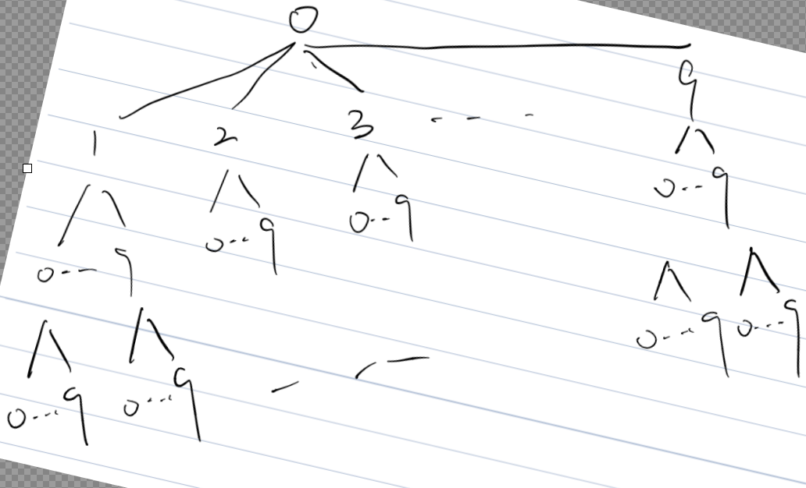

### Q：

给你一个整数 `n` ，按字典序返回范围 `[1, n]` 内所有整数。

你必须设计一个时间复杂度为 `O(n)` 且使用 `O(1)` 额外空间的算法。

<!-- more -->

### S：

首先：字典序可以抽象为一棵树，如下图所示



所以，有小到大输出其实就是输出他的先序遍历

**参考二叉搜索树的先序遍历写法**

​    1.递归：

​        此处不一样的是需要舍去头结点0，以1-9分别为根节点进行遍历输出：

​            1.递归结束条件，当前结点＞n，则递归结束

​            2.将元素值添加进入res,遍历其10个兄弟结点，进入递归其子节点

````java
```java
class Solution {
    public List<Integer> lexicalOrder(int n) {
        List<Integer> list = new ArrayList<>();
        for (int i = 1; i < 10; i++){
             dfs(n, i, list);
        }
        return list;
    }
    private void dfs(int n,int i,List<Integer>list){
        if(i>n){
            return ;
        }
        list.add(i);
        for(int j=0;j<=9;j++){
            dfs(n,i*10+j,list);
        }
    }

}
```
````


​    2.迭代:

​	**tipp **：`while(curr%10==0) curr/=10;` 这行代码的目的是处理那些在字典序中应该提前结束的数字。

例如，假设 `n` 是 130。我们在字典序中遍历时，应该是这样的顺序：1, 10, 11, ..., 19, 2, 20, ..., 29, ..., 13, 130, 14, ..., 19, 2, ..., 9。

当我们的 `curr` 变成 130 后，如果我们直接 `curr+=1`，那么 `curr` 就变成了 131，这显然是超过 `n` 的，而且不符合字典序。我们应该跳过所有 13x（x > 0）的数字，直接变成 14。

这就是 `while(curr%10==0) curr/=10;` 这行代码的目的：当 `curr` 的最后一位是 0（即 `curr%10==0`）时，我们应该退回到上一层（即 `curr/=10`）。在这个例子中，130 退回到 13，然后 `curr+=1` 变成 14，这样就符合字典序了。

这样的处理能保证我们的遍历顺序始终是按照字典序进行的，即先遍历同一层的数，然后再遍历下一层的数。

       ```java
       class Solution {
            public List<Integer> lexicalOrder(int n) {
                List<Integer> list = new ArrayList<>();
                int curr = 1;
                // 遍历/traverse
                for(int i=0;i<n;i++){
                    list.add(curr);
                    if(curr*10<=n){
                        curr*=10;//遍历下一层/find next level number
                    }else{
                        if(curr>=n)   curr/=10;//如果比n大，结束遍历退回上一层/If greater than n, end traversal and return to previous level
                        curr+=1;
                        while(curr%10==0) curr/=10;
                    }
                }
                return list;
            }
       
       }
       ```

