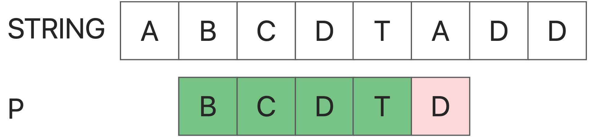
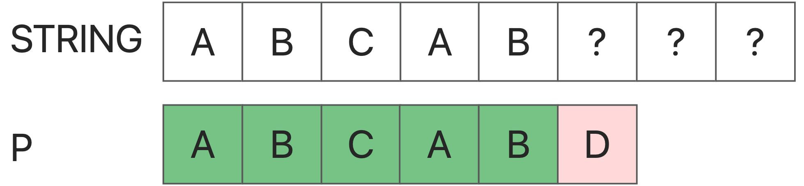
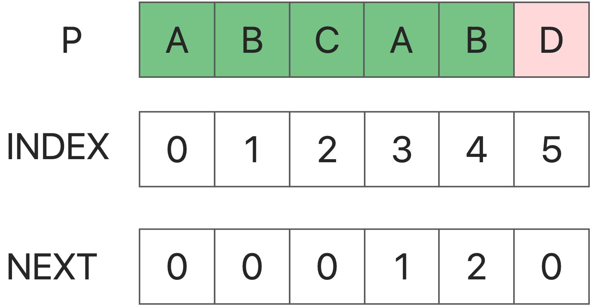

### KMP算法:

​	KMP (Knuth-Morris-Pratt) 算法是一种用于字符串搜索的算法，可以在一个文本串S内查找一个词W的出现位置。

基本思想是，当子串与目标字符串不匹配时，其已知足够的信息能确定下一步的搜索不会导致目标字符串的漏检。这样，算法就不会进行无效的检查。

下面是KMP算法的步骤：

1. 构造一个"部分匹配表"（也称为 "失败函数"）。这是一个数组，对于给定的查找词，表中的每个元素都包含了当匹配失败时查找词应该跳转的位置。
2. 使用这个表来进行字符串搜索。当在文本串中发生匹配失败时，可以直接跳过前面已知不会匹配的部分。

<!-- more -->

### Why KMP

​	传统的字符串匹配，如果从String[i]的比较失败，算法直接开始尝试从S[i+1]进行比较。这种行为是典型的 "不从以前的错误中学习"。我们应该注意到，一个失败的匹配将为我们提供有价值的信息--**如果String[i : i+len(P)]和P之间的匹配在第r个位置失败，那么从S[i]：第一个（r-1）连续字符必须与P的第一个（r-1）字符完全相同**。



​	因此，我们可以尽可能地跳过这些不可能的字符串来优化我们的方法。
举个例子：



​	首先，P[5]未能匹配，那么这意味着S[0:5]等于P[0:5]，也就是 "abcab"。
现在我们考虑：从S[1]，S[2]，S[3]最初的匹配尝试是否有机会成功？
当我们从S[1]开始时，它不会成功。因为我们可以看到：P[1]！=P[0]，但P[1]=S[1]，所以P[0]！=S[1]。
在S[2]中也是如此。
但是当我们从S[3]开始时（这很重要）： **P[0] = P[3], S[3] = P[3], 所以P[0] = S[3].**
我们可以发现，在S[3]中，有可能匹配成功。而且我们会发现，如果知道S和P在长度L内是相同的，那么任何一个i是否可以作为匹配的起点，只取决于P[0]=P[i]是否相等。这里我们可以得到KMP算法的核心下一个数组

### NextArray

​	下一个数组是用于模式字符串。P的下一个数组定义为：： **next[i]代表P[0]~P[i]的一个子串，因此前k个字符正好等于后k个字符的最大k。特别是，k不能是i+1 **(因为这个子串总共只有i+1个字符，它必须等于它自己，所以它没有意义)。 **事实上，它是为了得到不同起点i时P串中最长的相同前缀和后缀的最大长度**。



### 匹配

```java
        int i=0;
        int j = 0;
        getNext(needle,next);
        while (i < length && j < length1)
        {
            if (j == -1 || haystack.charAt(i) == needle.charAt(j))
            {
                i++;
                j++;
            }
            else {
                j = next[j];
            }
        }
```


#### 首先：我们使用两个点来捕捉字符串。问题是如何改变这个点？

#### 第二： 

 	String[i] != P [j] ,现在我们需要改变j来找到一个新的开始，即String的前缀等同于P。所以，下一个数组是有用的：` j = next[j]`。

### 如何获得下一个数组

```java
void getNext(String p, int [] next)
    {
        next[0] = -1;
        int i = 0, j = -1;

        while (i < (p.length())){
            if (j == -1 || p.charAt(i)==p.charAt(j)) {
                ++i;
                ++j;
                next[i] = j;
            }
            else {
                j = next[j];
            }
        }
    }
```

**这段代码使用了一个小技巧：使next[0]=-1.你可以记住它，这将使代码更加容易；**

### 动态规划：

next[i]是指p[0,next[i]]=p[i-next[i],i]的最大值(i)
那么，如果我们知道next[0],next[1],...next[i-1]，如何知道next[i]？
设置`next[i-1] = pre`。
如果`p[i]=p[pre+1]`，这意味着`下一个[i]=pre+1`。
否则如果`p[i] != p[pre+1],`就意味着`p[i-pre-1,i-1] = p[pre-1]`。
我们应该减少pre:`pre = next[pre]`。


### Code:

```java
/**
     * now we can use kmp algorithm，a prefix matching algorithm
     *
     */

    public int strStr(String haystack, String needle){
        //in first method,we can find that we need match all the substring if it's not match.
        //some message have been lost: the prefix of the last string we have compared.
        //we can start with the same prefix string to match,so that the time can be saved
        // we can store the same prefix in a array or list, so we called kmp algorithm
        int length = haystack.length();
        int length1 = needle.length();
        int i=0;
        int j = 0;
        int [] next = new int [length1];
        getNext(needle,next);
        while (i < length && j < length1)
        {
            if (j == -1 || haystack.charAt(i) == needle.charAt(j))
            {
                i++;
                j++;
            }
            else {
                j = next[j];
            }
        }

        if (j == length1){
            return i - j;
        }
        else {
            return -1;
        }
    }

    void getNext(String p, int [] next)
    {
        next[0] = -1;
        int i = 0, j = -1;

        while (i < (p.length())){
            if (j == -1 || p.charAt(i)==p.charAt(j)) {
                ++i;
                ++j;
                next[i] = j;
            }
            else {
                j = next[j];
            }
        }
    }
```

